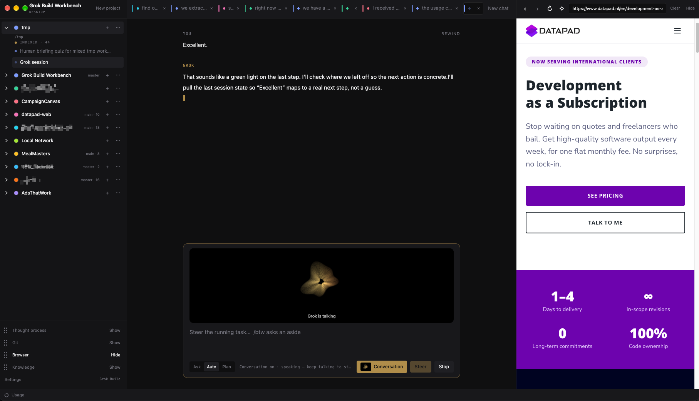

# Grok Build Workbench

Unofficial desktop for [Grok Build](https://grok.com/build). Projects in a sidebar, multiple chats at once.
Thought process window, Browser window, Git Window

Not affiliated with, endorsed by, or sponsored by SpaceXAI / xAI. “Grok” and “Grok Build” are their marks.

## Run

1. Install the [Grok Build CLI](https://x.ai/news/grok-build-cli) and sign in: `grok login` (SuperGrok).
2. `npm install`
3. `npm run dev`

Chats are real Grok Build sessions. Sessions already on disk for a folder show up in that project.

`npm run typecheck` is the compile gate. `npm run build` emits the Electron bundle to `out/`.

## What works now

- Native desktop window
- Projects, optional local folder
- Multiple chats per project
- Concurrent streams: switch tabs without cancelling
- In-app browser, Git pane, worktree isolation, checkpoints, slash commands
- Grok 4.6 by default

## License

[MIT](LICENSE)

## Contributing

See [CONTRIBUTING.md](CONTRIBUTING.md). To report a vulnerability, see [SECURITY.md](SECURITY.md).
